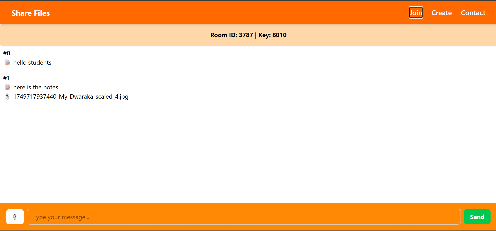

# 📁 Share Files App

A minimal real-time file and text sharing web app. Join a room, chat, and share files instantly — all without signing up.



---

## 🚀 Features

- 🔐 Create or join rooms using a unique Room ID & Key
- 💬 Share plain text messages
- 📎 Upload and download files with messages
- 🖥️ Real-time chat interface
- ⚡ Built with MERN Stack

---

## 🧰 Tech Stack

- **Frontend**: React + TailwindCSS
- **Backend**: Node.js + Express
- **Database**: In-memory data store (array-based, sample only)
- **File Upload**: `multer` (saved to `uploads/` directory)

---

## 🛠️ How to Run Locally

### Prerequisites:
- Node.js installed
- npm or yarn
- React development environment

### 1. Clone the repository
```bash
git clone https://github.com/your-username/share-files-app.git
cd share-files-app
